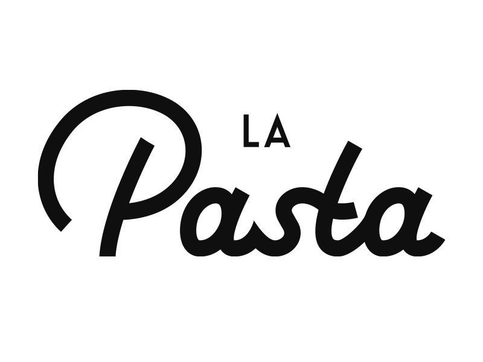

# LaPasta - Online Food Ordering Website

Welcome to **LaPasta**, a web application that allows users to conveniently order delicious Italian cuisine from our restaurant. This repository contains all the code and resources required to run the website smoothly. Whether you're craving pasta, pizza, or any other Italian specialty, LaPasta has got you covered!

What so special about the website? is that you have a reservation system that is connected to WhatsApp and the details of the reservation go directly to the owner of the restaurant.




Live Site : http://omerbentzi.github.io/La-Pasta-Website.github.io
## Table of Contents

- [Features](#features)
- [Technologies Used](#technologies-used)
- [Getting Started](#getting-started)
- [Prerequisites](#prerequisites)
- [Installation](#installation)
- [Usage](#usage)
- [Contributing](#contributing)
- [License](#license)

## Features

- Browse the menu of our restaurant.
- Add items to your cart.
- Customize your order with special instructions.
- Place and confirm your order.
- Responsive design for optimal use on various devices.
- User-friendly and intuitive interface.

## Technologies Used

- HTML 
- CSS 
- JavaScript 
- Bootstrap 
- Node-JS 
- Express-JS  
- MongoDB  

## Getting Started

Follow these instructions to get the project up and running on your local machine.

### Prerequisites

- Web browser (Chrome, Firefox, Safari, etc.)
- Internet connection

### Installation

1. Clone the repository to your local machine using the following command:

   ```bash
   [git clone https://github.com/your-username/LaPasta.git](https://github.com/OmerBentzi/La-Pasta-Website.github.io.git)
   ```

2. Navigate to the project directory:

   ```bash
   La-Pasta-Website.github.io
 

3. Open the `index.html` file in your preferred web browser.

## Usage

1. Upon opening the website, you'll be greeted with the home page showcasing our delicious Italian dishes.
2. Browse through the menu categories and select items you want to order.
3. Click on the "Add to Cart" button to add items to your cart.
4. Navigate to the cart to review your order. You can modify quantities and add special instructions if needed.
5. Click the "Place Order" button to confirm your order.
6. You'll receive an order confirmation along with an estimated delivery time.

## Contributing

We welcome contributions to enhance the features and user experience of LaPasta. If you would like to contribute, please follow these steps:

1. Fork the repository.
2. Create a new branch for your feature or bug fix:
   ```bash
   gh repo clone OmerBentzi/La-Pasta-Website.github.io
   ```
3. Make your modifications and commit them with descriptive commit messages.
4. Push your changes to your forked repository.
5. Create a pull request to the main repository's `main` branch, detailing your changes and improvements.

## License

This project is licensed under the [MIT License](https://opensource.org/licenses/MIT).

---

Thank you for choosing LaPasta! We hope you enjoy using our online food ordering website. If you encounter any issues or have suggestions for improvements, please don't hesitate to reach out to us. Happy ordering! 🍝🍕
